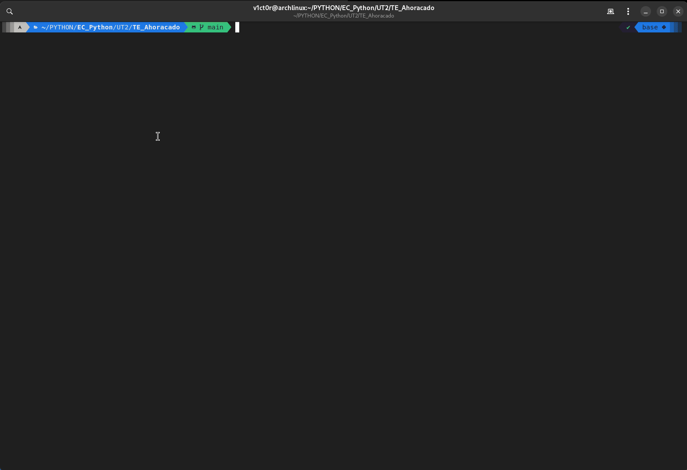

# ahorcado

Hangman Game
This Python script is a simple implementation of the classic Hangman game. The game is played by guessing letters to try and guess a word. The player has a limited number of attempts to guess the word.

Code Explanation
The script imports necessary modules and functions at the beginning. It sets the maximum number of attempts to 11.

generar_palabra(dificultad: int) -> str | None:
This function generates a random word from a text file based on the selected difficulty level. The difficulty level corresponds to the length of the word. It reads all the lines from the file, selects a random word, removes any white spaces, and converts the word to lowercase. If the length of the word matches the difficulty level, it returns the word. If the file is not found, it prints an error message and returns None.

comprobar_entrada(nueva_letra: str, letras_introducidas: list) -> bool:
This function checks if the input letter has been entered before. It takes the new letter and the list of previously entered letters as arguments. If the new letter is in the list of previously entered letters, it returns True. Otherwise, it returns False.

get_nueva_letra(letras_introducidas: list) -> str:
This function gets a new letter from the user. It only accepts lowercase letters of the Spanish alphabet, without accents, umlauts, or special characters. It asks the user to enter a letter, converts it to lowercase, and checks if it's a valid character. If the letter is not in the list of valid characters, it prints an error message. If the letter has not been entered before, it adds the letter to the list of entered letters and returns the letter. If there's a TypeError or ValueError, it prints an error message.

How to Play
To play the game, run the script. You will be asked to enter a difficulty level. Then, you will be asked to guess letters one by one. If you guess a letter correctly, it will be revealed in the word. If you guess incorrectly, one part of the hangman will be drawn. The game continues until you guess the word or the hangman is fully drawn.

